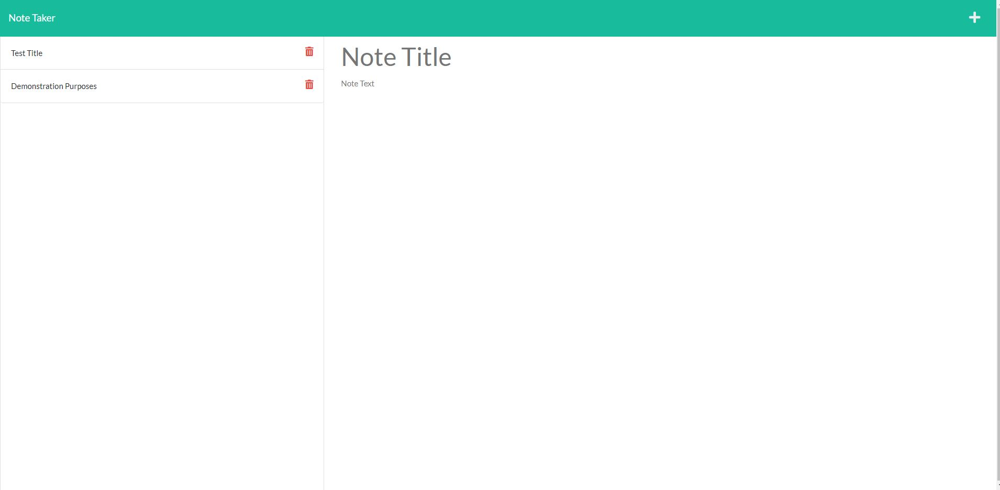

# TB Note Taker App

## Table of Contents:
  - [User Story](#user-story)
  - [Acceptance Criteria](#acceptance-criteria)
  - [Deployment](#deployment)
  - [Screenshot](#screenshot)
  - [Description](#description)
  - [License](#license)
  - [Built With](#built-with)
  - [Contributing](#contributing)
  - [Questions](#questions)

## User Story
* AS A small business owner
* I WANT to be able to write and save notes
* SO THAT I can organize my thoughts and keep track of tasks I need to complete

## Acceptance Criteria
* GIVEN a note-taking application
* WHEN I open the Note Taker
* THEN I am presented with a landing page with a link to a notes page
* WHEN I click on the link to the notes page
* THEN I am presented with a page with existing notes listed in the left-hand column, plus empty fields to enter a new note title and the note’s text in the right-hand column
* WHEN I enter a new note title and the note’s text
* THEN a Save icon appears in the navigation at the top of the page
* WHEN I click on the Save icon
* THEN the new note I have entered is saved and appears in the left-hand column with the other existing notes
* WHEN I click on an existing note in the list in the left-hand column
* THEN that note appears in the right-hand column
* WHEN I click on the Write icon in the navigation at the top of the page
* THEN I am presented with empty fields to enter a new note title and the note’s text in the right-hand column
  
## Deployment
Link to live version of app: https://tb-note-taker-app.herokuapp.com/

## Screenshot

## Description
This app can be used to create, save, and delete notes

## License
This project is covered under the MIT license.

## Built With
* HTML
* CSS
* JavaScript
* Node.js
* Express.js

## Contributing
You can reach out to me via the contact information at the bottom if you would like to contribute to this project

## Questions
If you have any questions in regards to this project 

You can contact me on GitHub at: https://github.com/1tbrooks1 

You can also 📧 email me at: tbrooks321@yahoo.com for any other questions